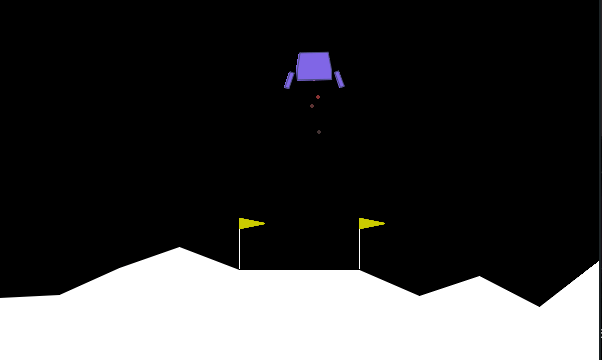
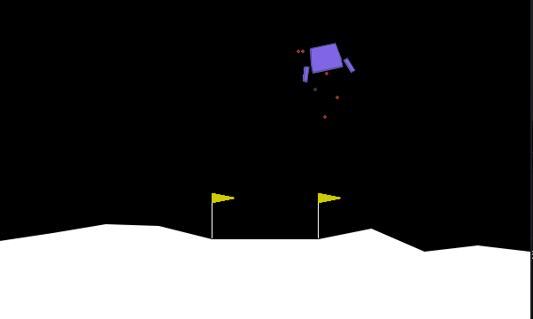
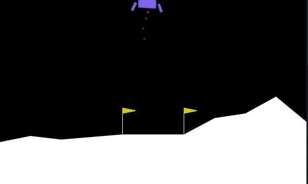

# ai

Hand crafted AI algorithms made with tender loving care (and numpy)

This repo contains

- An implementation of [Natural Evolution Strategies](https://blog.otoro.net/2017/10/29/visual-evolution-strategies#natural-evolution-strategies) (the [OpenAI variant](https://openai.com/blog/evolution-strategies/) where sigma is fixed, for simplicity)
- An implementation of [Covariance-Matrix Adaptation](https://blog.otoro.net/2017/10/29/visual-evolution-strategies/#covariance-matrix-adaptation-evolution-strategy-cma-es) (CMA-ES), along with an adapter for [pycma](https://github.com/CMA-ES/pycma).
- A few pretrained networks in `./nets`

## Lunar Lander

After way too much training NES with a low sigma it was able to mostly solve Lunar Lander



Sometimes it fails, though it usually comes close



To test it yourself make sure `nets/LunarLanderContinuous-v2-16.pkl` exists then run

```
python main.py --env LunarLanderContinuous-v2 --eval
```

An agent was also trained using Covariance-Matrix Adaptation (the `--cma` option). After ~220 generations it looks like this



The resulting agent is more robust, and successfully deactivates the boosters after landing. I think this is because CMA-ES can fine-tune better by adapting sigma, I ought to try sigma-adaptation for my NES agent too.

See the CMA-ES agent with

```
python main.py --env LunarLanderContinuous-v2 --eval --save LunarLanderContinuous-v2-16-CMA.pkl
```
